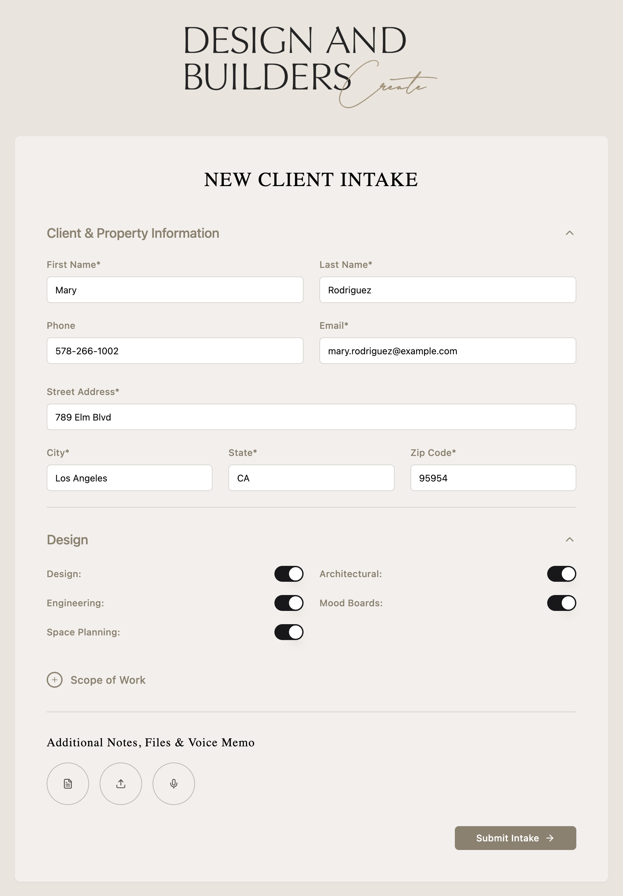

# D&C Builders — Proposal PDF Generator

Generates professional project proposal PDFs from client intake data.
Claude writes the content. Python renders the PDF. No design software needed.

---

## System Overview

```
[Intake Form] → [Supabase] → [Claude Code] → [Python Script] → [PDF]
```

See [ARCHITECTURE.md](ARCHITECTURE.md) for the full system design.

---

## Intake Form

The client intake form collects all project information needed to generate a proposal.



**Live form:** https://dc-builders-project-intake-52184b10.base44.app/IntakeForm

**Local artifact:** Open `artifact_form.html` inside Claude.ai — add your Supabase credentials to connect.

---

## Repository Structure

```
dcb-proposal-generator/
├── CLAUDE.md                          ← Auto-loaded by Claude Code (start here)
├── ARCHITECTURE.md                    ← Full system design
├── PROPOSAL_WRITING_GUIDE.md          ← How Claude writes scope content
├── supabase_schema.sql                ← Run in Supabase SQL Editor
├── artifact_form.html                 ← Intake form UI
├── generate_proposal.py               ← Standard renderer (up to 9 pages)
├── generate_proposal_full_scope.py    ← Full renderer (up to 12 pages)
├── README.md                          ← This file
├── client_brief_example.md            ← Client data format reference
├── clients/
│   ├── example_restrepo.json          ← Minimal example
│   └── test_martinez_full_scope.json  ← Full scope example (6 items)
└── .claude/
    └── skills/
        └── generate-proposal.md       ← /generate-proposal slash command
```

---

## One-Time Setup (new machine)

### macOS
```bash
brew install pango
pip3 install weasyprint
```

### Linux (Ubuntu/Debian)
```bash
sudo apt install libpango-1.0-0 libpangoft2-1.0-0
pip3 install weasyprint
```

### Windows
1. Install GTK3: https://github.com/tschoonj/GTK-for-Windows-Runtime-Environment-Installer/releases
2. Restart terminal
3. `pip install weasyprint`

---

## Generating a Proposal

### Option A — Via Claude Code (recommended)

Clone the repo, open in Claude Code, and run:
```
/generate-proposal
```
Claude reads the latest Supabase intake, writes all scope content, builds the payment
schedule, and generates the PDF automatically.

### Option B — From a JSON file

```bash
# macOS
DYLD_LIBRARY_PATH=/opt/homebrew/lib python3 generate_proposal_full_scope.py --json clients/myClient.json

# Linux / Windows
python3 generate_proposal_full_scope.py --json clients/myClient.json
```

### Which script to use

| Project type | Script |
|---|---|
| 1–3 scope items, simple remodel | `generate_proposal.py` |
| 4+ scope items, 2nd story, ADU, roofing | `generate_proposal_full_scope.py` |

---

## JSON Config Reference

| Field | Type | Description |
|---|---|---|
| `client_name` | string | Full client name — appears on cover |
| `client_address` | string | Full address — appears on cover |
| `proposal_date` | string | e.g. `"March 2026"` |
| `project_total` | string | e.g. `"$298,800"` |
| `scope_items` | list of strings | Cover page bullets (max 6, max ~30 chars each) |
| `payments` | list of `[description, amount]` | Payment milestones (Claude auto-generates if empty) |
| `output_path` | string (optional) | Custom output path |

### Example JSON

```json
{
  "client_name":    "Robert & Angela Martinez",
  "client_address": "4821 Seabreeze Lane, Huntington Beach, CA 92648",
  "proposal_date":  "March 2026",
  "project_total":  "$541,000",
  "scope_items": [
    "Plans & Engineering",
    "Full 2nd Story Addition (1,200 SF)",
    "Complete Kitchen Remodel",
    "Master Bathroom Remodel",
    "Garage Conversion to ADU (400 SF)",
    "Roofing (Full Replacement)"
  ],
  "payments": [
    ["Down payment", "$1,000"],
    ["Mobilization & Start Architectural Design", "$18,000"],
    ["Upon Completion & Final Punch List", "$12,000"]
  ]
}
```

---

## Transfer to Another Computer

```bash
git clone https://github.com/Morfeu333/dcb-proposal-generator
cd dcb-proposal-generator
brew install pango && pip3 install weasyprint
```

Open the folder in Claude Code — `CLAUDE.md` is loaded automatically and Claude is
fully contextualized with no extra prompting needed.

---

## Key Docs

- [ARCHITECTURE.md](ARCHITECTURE.md) — How the system works end to end
- [PROPOSAL_WRITING_GUIDE.md](PROPOSAL_WRITING_GUIDE.md) — Content rules for Claude
- [supabase_schema.sql](supabase_schema.sql) — Database setup
- [.claude/skills/generate-proposal.md](.claude/skills/generate-proposal.md) — Slash command reference
